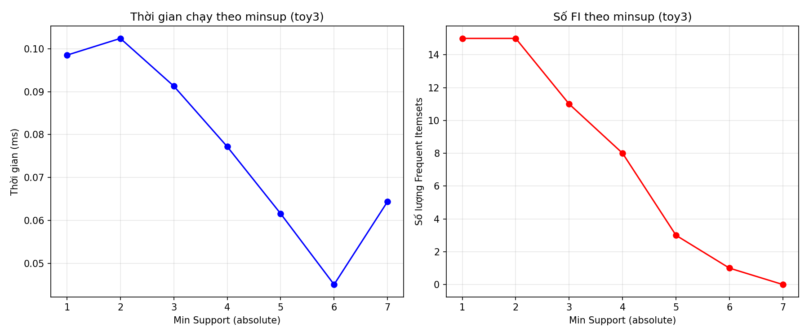
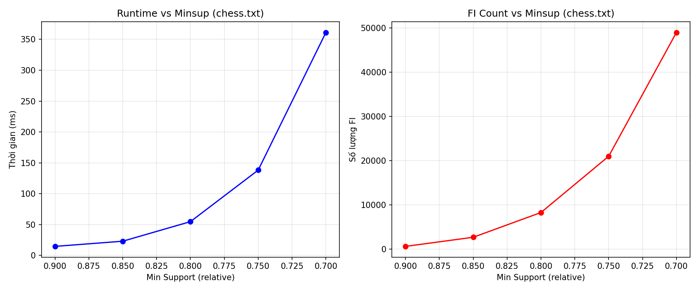
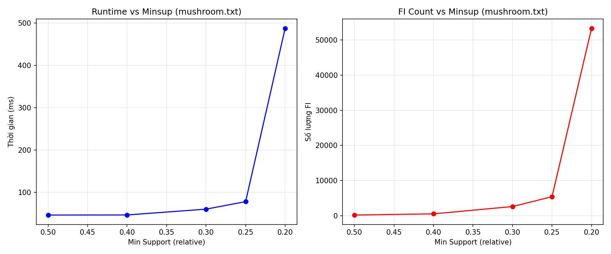
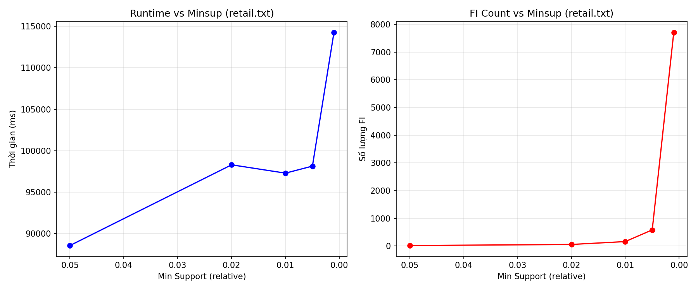
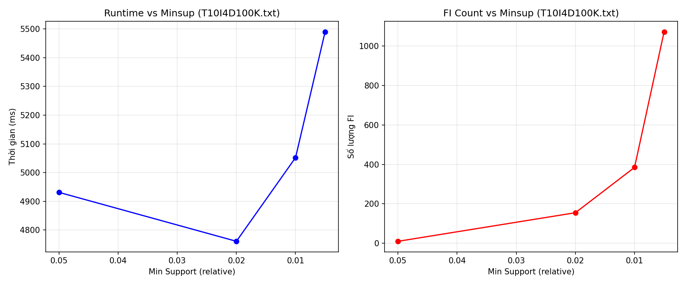
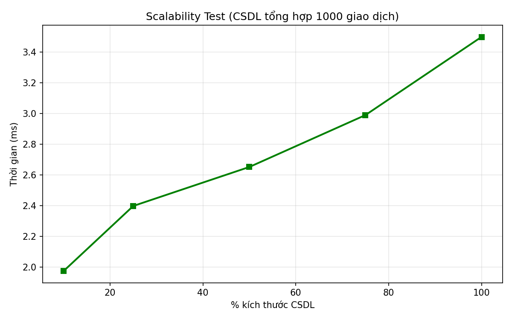

# Đồ Án 2: Khai Thác Tập Phổ Biến Bằng Thuật Toán Apriori

**Môn học:** Khai thác dữ liệu và ứng dụng (CSC14004)  
**Học kỳ:** HK2 - 2025-2026  
**Đề tài:** Frequent Itemset Mining - Nghiên cứu, cài đặt và đánh giá  
**Ngôn ngữ cài đặt:** Python 3.9+  
**Thuật toán được chọn:** Apriori

---

## Mục lục

1. [Chương 1. Nền tảng lý thuyết](#chương-1-nền-tảng-lý-thuyết)
2. [Chương 2. Ví dụ minh họa tay](#chương-2-ví-dụ-minh-họa-tay)
3. [Chương 3. Cài đặt](#chương-3-cài-đặt)
4. [Chương 4. Thực nghiệm và đánh giá](#chương-4-thực-nghiệm-và-đánh-giá)
5. [Chương 5. Ứng dụng thực tế](#chương-5-ứng-dụng-thực-tế)
6. [Kết luận](#kết-luận)
7. [Tài liệu tham khảo](#tài-liệu-tham-khảo)

---

## Chương 1. Nền tảng lý thuyết

### 1.1. Bài toán Frequent Itemset Mining

Cho tập tất cả các item là $I = \{i_1, i_2, ..., i_m\}$. Một **giao dịch** (transaction) là một tập con $T \subseteq I$. Một **cơ sở dữ liệu giao dịch** là:

$$
D = \{T_1, T_2, ..., T_n\}, \quad T_j \subseteq I.
$$

Với một itemset $X \subseteq I$, **độ hỗ trợ tuyệt đối** của $X$ trong cơ sở dữ liệu $D$ được định nghĩa là:

$$
\mathrm{sup}_D(X) = |\{T \in D \mid X \subseteq T\}|.
$$

**Độ hỗ trợ tương đối** là:

$$
\mathrm{rsup}_D(X) = \frac{\mathrm{sup}_D(X)}{|D|}.
$$

Cho trước ngưỡng hỗ trợ tối thiểu `minsup`, itemset $X$ được gọi là **frequent itemset** nếu:

$$
\mathrm{sup}_D(X) \ge \mathrm{minsup}_{abs}
\quad \text{hoặc tương đương} \quad
\mathrm{rsup}_D(X) \ge \mathrm{minsup}_{rel}.
$$

Trong đồ án này, chương trình hỗ trợ cả hai cách nhập:

- `minsup` tương đối trong đoạn `[0, 1]`
- `minsup` tuyệt đối thông qua cờ `--absolute`

### 1.2. Closed itemset và maximal itemset

Một itemset frequent $X$ được gọi là **closed** nếu không tồn tại frequent superset $Y \supset X$ sao cho:

$$
\mathrm{sup}(Y) = \mathrm{sup}(X).
$$

Một itemset frequent $X$ được gọi là **maximal** nếu không tồn tại frequent superset $Y \supset X$.

Quan hệ giữa ba họ tập này là:

$$
\{\text{maximal itemsets}\} \subseteq \{\text{closed itemsets}\} \subseteq \{\text{frequent itemsets}\}.
$$

Giải thích trực quan:

- Mọi maximal itemset đều là closed vì nó không có frequent superset nào.
- Mọi closed itemset đều frequent theo định nghĩa.
- Chiều ngược lại nói chung không đúng: có frequent itemset không closed, và có closed itemset không maximal.

### 1.3. Tính chất Apriori

Thuật toán Apriori dựa trên tính chất anti-monotone của support, thường được gọi là **Apriori property** hay **downward closure**:

> Nếu một itemset là frequent thì mọi tập con không rỗng của nó cũng frequent.

Tương đương:

> Nếu một itemset không frequent thì mọi superset của nó đều không frequent.

**Chứng minh ngắn gọn.**  
Cho hai itemset $X \subseteq Y$. Mọi giao dịch chứa $Y$ thì chắc chắn cũng chứa $X$. Do đó:

$$
\{T \in D \mid Y \subseteq T\} \subseteq \{T \in D \mid X \subseteq T\}.
$$

Suy ra:

$$
\mathrm{sup}(Y) \le \mathrm{sup}(X).
$$

Vì support không tăng khi mở rộng itemset, nếu $X$ không đạt `minsup` thì mọi $Y \supseteq X$ cũng không thể đạt `minsup`. Đây là cơ sở để Apriori tỉa mạnh candidate ở mỗi mức $k$.

### 1.4. Phân tích thuật toán Apriori

#### 1.4.1. Ý tưởng cốt lõi

Apriori khai thác frequent itemsets theo chiến lược **level-wise search**:

1. Tìm tất cả frequent 1-itemsets, ký hiệu $L_1$.
2. Từ $L_{k-1}$ sinh ra candidate $k$-itemsets $C_k$ bằng phép join.
3. Dùng tính chất Apriori để prune các candidate có tập con không frequent.
4. Quét cơ sở dữ liệu để đếm support các candidate còn lại.
5. Giữ lại các candidate đủ ngưỡng để thu được $L_k$.
6. Dừng khi $L_k = \emptyset$.

Điểm mạnh của Apriori là đơn giản, dễ cài đặt, dễ kiểm chứng tính đúng đắn và tận dụng được tính chất anti-monotone để giảm không gian tìm kiếm. Điểm yếu là số lượng candidate có thể tăng bùng nổ khi dữ liệu dày đặc hoặc `minsup` thấp.

#### 1.4.2. Cấu trúc dữ liệu chính trong cài đặt

Trong repo này, cài đặt Apriori dùng hai lớp biểu diễn chính:

- **Horizontal representation**: mỗi giao dịch là một `frozenset[int]`
- **Vertical representation bằng bitarray**: với mỗi item, lưu một vector bit có độ dài bằng số giao dịch; bit thứ `t` bằng `1` nếu item xuất hiện trong giao dịch `t`

Phần cài đặt tương ứng nằm ở:

- [src/algorithm/apriori.py](src/algorithm/apriori.py)
- [src/structures.py](src/structures.py)
- [src/utils.py](src/utils.py)

Nếu biểu diễn dọc được bật, support của itemset $\{i_1, i_2, ..., i_k\}$ được tính bằng phép AND bit:

$$
\mathrm{tidset}(i_1 \cup ... \cup i_k)
= \mathrm{tidset}(i_1) \land ... \land \mathrm{tidset}(i_k).
$$

Support của itemset chính là số bit `1` trong kết quả. Đây là tối ưu hóa quan trọng của nhóm vì:

- tránh duyệt lại toàn bộ cơ sở dữ liệu cho từng candidate
- giảm chi phí kiểm tra `issubset` trên dữ liệu lớn
- phù hợp với thao tác bit-level có hiệu năng cao

#### 1.4.3. Giả mã

```text
APRIORI(D, minsup):
    L1 = frequent_1_itemsets(D, minsup)
    L = L1
    k = 2

    while L(k-1) != empty:
        Ck = apriori_gen(L(k-1))
        for each candidate c in Ck:
            support[c] = count_support(D, c)
        Lk = { c in Ck | support[c] >= minsup }
        L = L union Lk
        k = k + 1

    return L
```

Trong đó hàm `apriori_gen(L(k-1))` gồm hai bước:

1. **Join:** ghép hai frequent $(k-1)$-itemsets có cùng tiền tố dài `k-2`
2. **Prune:** loại candidate nếu tồn tại bất kỳ tập con kích thước `k-1` nào không thuộc `L(k-1)`

#### 1.4.4. Độ phức tạp

Gọi:

- $n = |D|$ là số giao dịch
- $m = |I|$ là số lượng item
- $w$ là độ dài giao dịch trung bình

**Trường hợp xấu nhất.**  
Khi `minsup` rất thấp và dữ liệu dày đặc, gần như mọi tập con của $I$ đều frequent. Khi đó Apriori có thể phải xét tới:

$$
\sum_{k=1}^{m}\binom{m}{k} = 2^m - 1
$$

itemsets. Đây là tăng trưởng theo hàm mũ.

**Chi phí đếm support.**

- Bản baseline: xấp xỉ $O(|C_k| \cdot n \cdot k)$ ở mức $k$
- Bản bitarray: xấp xỉ $O(|C_k| \cdot n / \omega)$ với $\omega$ là số bit xử lý song song trên một word máy, cộng chi phí `count()`

**Trường hợp tốt.**  
Khi `minsup` cao, số candidate ít, thuật toán dừng ở mức itemset nhỏ. Khi đó thời gian gần gần tuyến tính theo số giao dịch và số item phổ biến.

**Không gian bộ nhớ.**

- Lưu toàn bộ dữ liệu giao dịch: $O(n \cdot w)$
- Lưu bitarray cho từng item: $O(m \cdot n)$ bit
- Lưu candidate và frequent itemsets theo mức

**Các yếu tố ảnh hưởng hiệu năng.**

- số lượng giao dịch
- số lượng item phân biệt
- độ dài giao dịch trung bình
- độ dày/thưa của dữ liệu
- ngưỡng `minsup`
- mức độ bùng nổ candidate ở các tầng giữa

### 1.5. So sánh lịch sử

Apriori là một trong những thuật toán nền tảng nhất của Frequent Itemset Mining. Về lịch sử phát triển:

- **AIS/SETM** là các hướng khai phá luật kết hợp đời đầu nhưng sinh candidate chưa hiệu quả
- **Apriori** cải thiện đáng kể bằng cách tách bài toán thành tìm frequent itemsets và dùng downward closure để prune
- **Apriori-TID** thay thế dần các lần quét CSDL bằng tập ID giao dịch
- **Eclat** chuyển hẳn sang biểu diễn dọc, giao tidset hiệu quả hơn trên nhiều loại dữ liệu
- **FP-Growth** loại bỏ bước sinh candidate tường minh bằng cấu trúc FP-tree

Vị trí của Apriori trong dòng tiến hóa của FIM rất quan trọng:

- là mốc chuẩn để giảng dạy và đối chiếu
- dễ chứng minh đúng đắn
- làm cơ sở để hiểu vì sao các thuật toán đời sau tập trung vào giảm số lần quét và tránh candidate explosion

Trong đồ án này, việc chọn Apriori là phù hợp vì:

- bám sát phần lý thuyết cơ bản của môn học
- dễ kiểm thử bằng ví dụ tay
- cho phép minh họa rõ tác động của `minsup`, độ dài giao dịch và tính dày/thưa của dữ liệu

---

## Chương 2. Ví dụ minh họa tay

### 2.1. Ví dụ 1: Cơ sở

Chọn cơ sở dữ liệu `toy1.txt` gồm 5 giao dịch và 5 item, với `minsup = 2` giao dịch, tương đương `40%`.

| Giao dịch | Tập item |
|---|---|
| $T_1$ | {1, 3, 4} |
| $T_2$ | {2, 3, 5} |
| $T_3$ | {1, 2, 3, 5} |
| $T_4$ | {2, 5} |
| $T_5$ | {1, 2, 3, 4, 5} |

#### Bước 1. Sinh và lọc 1-itemsets

Đếm support từng item:

| Itemset | Support |
|---|---:|
| {1} | 3 |
| {2} | 4 |
| {3} | 4 |
| {4} | 2 |
| {5} | 4 |

Vì tất cả đều có support $\ge 2$, ta có:

$$
L_1 = \{\{1\}, \{2\}, \{3\}, \{4\}, \{5\}\}.
$$

#### Bước 2. Sinh 2-itemset candidates

Từ $L_1$, sinh toàn bộ 10 cặp:

$$
C_2 =
\{\{1,2\}, \{1,3\}, \{1,4\}, \{1,5\}, \{2,3\}, \{2,4\}, \{2,5\}, \{3,4\}, \{3,5\}, \{4,5\}\}.
$$

Đếm support:

| Itemset | Support | Frequent? |
|---|---:|---|
| {1,2} | 2 | Có |
| {1,3} | 3 | Có |
| {1,4} | 2 | Có |
| {1,5} | 2 | Có |
| {2,3} | 3 | Có |
| {2,4} | 1 | Không |
| {2,5} | 4 | Có |
| {3,4} | 2 | Có |
| {3,5} | 3 | Có |
| {4,5} | 1 | Không |

Suy ra:

$$
L_2 =
\{\{1,2\}, \{1,3\}, \{1,4\}, \{1,5\}, \{2,3\}, \{2,5\}, \{3,4\}, \{3,5\}\}.
$$

#### Bước 3. Sinh 3-itemset candidates bằng join và prune

Từ $L_2$, các 3-itemset có thể sinh ra và không bị prune là:

$$
C_3 =
\{\{1,2,3\}, \{1,2,5\}, \{1,3,4\}, \{1,3,5\}, \{2,3,5\}\}.
$$

Giải thích prune:

- `{1,2,4}` bị loại vì tập con `{2,4}` không frequent
- `{1,4,5}` bị loại vì tập con `{4,5}` không frequent
- `{2,3,4}` bị loại vì `{2,4}` không frequent
- `{3,4,5}` bị loại vì `{4,5}` không frequent

Đếm support:

| Itemset | Support | Frequent? |
|---|---:|---|
| {1,2,3} | 2 | Có |
| {1,2,5} | 2 | Có |
| {1,3,4} | 2 | Có |
| {1,3,5} | 2 | Có |
| {2,3,5} | 3 | Có |

Suy ra:

$$
L_3 = C_3.
$$

#### Bước 4. Sinh 4-itemset candidates

Candidate hợp lệ duy nhất là:

$$
C_4 = \{\{1,2,3,5\}\}
$$

vì bốn tập con kích thước 3 của nó là `{1,2,3}`, `{1,2,5}`, `{1,3,5}`, `{2,3,5}` đều frequent.

Đếm support:

| Itemset | Support | Frequent? |
|---|---:|---|
| {1,2,3,5} | 2 | Có |

Do đó:

$$
L_4 = \{\{1,2,3,5\}\}.
$$

Không thể sinh thêm 5-itemset frequent, thuật toán dừng.

#### Kết quả cuối cùng

Tổng số frequent itemsets là:

- 5 itemsets ở mức 1
- 8 itemsets ở mức 2
- 5 itemsets ở mức 3
- 1 itemset ở mức 4

Tổng cộng:

$$
5 + 8 + 5 + 1 = 19.
$$

#### Kiểm tra chéo thủ công

Liệt kê toàn bộ các frequent itemsets:

- 1-itemsets: `{1}`, `{2}`, `{3}`, `{4}`, `{5}`
- 2-itemsets: `{1,2}`, `{1,3}`, `{1,4}`, `{1,5}`, `{2,3}`, `{2,5}`, `{3,4}`, `{3,5}`
- 3-itemsets: `{1,2,3}`, `{1,2,5}`, `{1,3,4}`, `{1,3,5}`, `{2,3,5}`
- 4-itemsets: `{1,2,3,5}`

Danh sách này khớp hoàn toàn với unit test trong [tests/test_correctness.py](tests/test_correctness.py) và với kết quả khi chạy hàm `apriori()` trên `toy1.txt`.

### 2.2. Ví dụ 2: Tình huống đặc biệt

Chọn cơ sở dữ liệu `toy2_special.txt` gồm 5 giao dịch giống hệt nhau:

| Giao dịch | Tập item |
|---|---|
| $T_1$ | {1, 2, 3} |
| $T_2$ | {1, 2, 3} |
| $T_3$ | {1, 2, 3} |
| $T_4$ | {1, 2, 3} |
| $T_5$ | {1, 2, 3} |

Chọn `minsup = 5` hoặc tương đương `100%`. Khi đó:

- mọi 1-itemset đều có support 5
- mọi 2-itemset đều có support 5
- itemset `{1,2,3}` cũng có support 5

Toàn bộ các tập con không rỗng của `{1,2,3}` đều frequent:

$$
\{1\}, \{2\}, \{3\}, \{1,2\}, \{1,3\}, \{2,3\}, \{1,2,3\}.
$$

Đây là một trường hợp đặc biệt quan trọng vì:

- dữ liệu cực kỳ dày đặc
- support của các itemset con gần như bằng nhau
- số frequent itemsets tăng rất nhanh theo kích thước tập item

Ví dụ này cho thấy nhược điểm cổ điển của Apriori: dù thuật toán prune tốt, khi dữ liệu gần đồng nhất thì số candidate và số frequent itemsets vẫn có thể tăng mạnh. Đây chính là kiểu dữ liệu khiến các thuật toán như FP-Growth hay Eclat thường có lợi thế hơn.

---

## Chương 3. Cài đặt

### 3.1. Môi trường và công cụ

Dự án được cài đặt bằng Python, đáp ứng đúng ràng buộc của đề:

- Python `>= 3.9`
- thư viện được sử dụng: `numpy`, `pandas`, `bitarray`, `pytest`, `psutil`, `matplotlib`
- không dùng thư viện Frequent Itemset Mining có sẵn như `mlxtend`, `efficient-apriori` hay SPMF bindings

Tập phụ thuộc được khai báo trong [requirements.txt](requirements.txt).

### 3.2. Tổ chức mã nguồn

Mã nguồn chính được tách thành ba phần:

- [src/algorithm/apriori.py](src/algorithm/apriori.py): thuật toán Apriori, `apriori_gen`, CLI
- [src/structures.py](src/structures.py): lớp `TransactionDB` hỗ trợ horizontal scan và vertical bitarray
- [src/utils.py](src/utils.py): đọc dữ liệu SPMF, ghi kết quả, parse output định dạng SPMF

Ngoài ra:

- [tests/test_correctness.py](tests/test_correctness.py): kiểm thử tính đúng đắn trên 5 bộ dữ liệu toy
- [tests/test_benchmark.py](tests/test_benchmark.py): benchmark thời gian, bộ nhớ và sinh biểu đồ
- [notebooks/demo.ipynb](notebooks/demo.ipynb): notebook minh họa

### 3.3. Yêu cầu cài đặt cơ bản

#### 3.3.1. Cài đặt đúng thuật toán

Hàm chính:

```python
apriori(transactions, min_support, absolute=False, use_bitarray=True, verbose=False)
```

đầu vào là danh sách giao dịch, đầu ra là:

```python
Dict[frozenset, int]
```

tức ánh xạ từ `itemset` sang `absolute support count`.

Luồng xử lý chính:

1. chuẩn hóa `minsup` thành support tuyệt đối
2. xây dựng `TransactionDB`
3. tìm `L1`
4. lặp theo mức `k`
5. sinh candidate bằng `apriori_gen`
6. đếm support và lọc ra `Lk`
7. hợp nhất kết quả toàn cục

#### 3.3.2. I/O chuẩn SPMF

Repo hỗ trợ đầy đủ định dạng SPMF:

- input: mỗi dòng là một giao dịch, các item cách nhau bởi dấu cách
- output: `item1 item2 ... #SUP: count`

Các hàm liên quan:

- `load_transactions_spmf()`
- `save_results_spmf()`
- `load_spmf_output()`

Nhờ đó, pipeline so sánh với SPMF có thể thực hiện trực tiếp bằng cách:

1. chạy cài đặt Python để xuất kết quả
2. chạy SPMF trên cùng dữ liệu và `minsup`
3. nạp hai file output và so khớp từng itemset cùng support

### 3.4. Tối ưu hóa bộ nhớ và tốc độ

Repo hiện có hai biến thể:

- `apriori_baseline()`: quét ngang, kiểm tra `issubset` trực tiếp
- `apriori(..., use_bitarray=True)`: dùng bitarray để đếm support

Tối ưu hóa được áp dụng:

1. **Vertical layout bằng bitarray**  
   mỗi item được ánh xạ sang một vector bit theo transaction ID

2. **Tính support bằng phép AND bit**  
   support của itemset được tính bằng giao các tidset

3. **Join theo prefix đã sắp xếp**  
   giảm candidate không cần thiết

4. **Prune sớm bằng Apriori property**  
   loại candidate nếu có tập con không frequent

Lưu ý rằng trong cài đặt hiện tại, chi phí bộ nhớ của bitarray có thể cao hơn baseline ở vài tác vụ nhỏ, nhưng đổi lại thời gian chạy trên dữ liệu dense thường tốt hơn rõ rệt.

### 3.5. Tham số dòng lệnh

Chương trình có thể chạy trực tiếp từ command line:

```bash
python -m src.algorithm.apriori --input data/toy/toy1.txt --minsup 0.4
python -m src.algorithm.apriori --input data/toy/toy1.txt --minsup 2 --absolute
python -m src.algorithm.apriori --input data/benchmark/mushroom.txt --minsup 0.3 --output result.txt
```

Các tham số hỗ trợ:

| Tham số | Ý nghĩa |
|---|---|
| `--input` / `-i` | đường dẫn file dữ liệu |
| `--minsup` / `-s` | ngưỡng hỗ trợ tối thiểu |
| `--absolute` / `-a` | hiểu `minsup` là support tuyệt đối |
| `--output` / `-o` | file xuất kết quả |
| `--no-bitarray` | tắt tối ưu bitarray để chạy baseline |
| `--verbose` / `-v` | in log chi tiết |

### 3.6. Kiểm thử tự động

Repo có 5 bộ dữ liệu toy:

- `toy1.txt`
- `toy2_special.txt`
- `toy3.txt`
- `toy4_single.txt`
- `toy5_dense.txt`

Bộ kiểm thử [tests/test_correctness.py](tests/test_correctness.py) bao phủ:

- support tính tay trên dữ liệu nhỏ
- số lượng frequent itemsets
- so sánh minsup tương đối và tuyệt đối
- edge cases như CSDL rỗng, minsup = 100%, chỉ có 1 giao dịch
- so sánh bản bitarray với baseline

Kết quả chạy thực tế trong môi trường hiện tại:

```text
21 passed in 0.21s
```

Điều này cho thấy cài đặt hiện tại ổn định trên các trường hợp minh họa và kiểm tra chéo bằng tay.

---

## Chương 4. Thực nghiệm và đánh giá

### 4.1. Tập dữ liệu benchmark

Repo hiện có 4 benchmark tối thiểu theo yêu cầu đề bài:

| Dataset | Số giao dịch | Số item | Độ dài TB | Đặc trưng |
|---|---:|---:|---:|---|
| Chess | 3,196 | 75 | 37.0 | Dense, itemset dài |
| Mushroom | 8,416 | 119 | 23.0 | Dense |
| Retail | 88,162 | 16,470 | 10.306 | Sparse, thực tế |
| T10I4D100K | 100,000 | 870 | 10.102 | Synthetic, sparse |

Các giá trị trên được đọc lại trực tiếp từ dữ liệu trong thư mục [data/benchmark](data/benchmark).

### 4.2. Kiểm tra tính đúng đắn

Tính đúng đắn được kiểm tra ở hai mức.

**Mức 1: unit test trên dữ liệu toy.**

- `21/21` test pass
- bao phủ 5 cơ sở dữ liệu khác nhau
- có cả ví dụ cơ sở và tình huống đặc biệt

**Mức 2: tương thích định dạng SPMF.**

Repo hỗ trợ:

- xuất kết quả theo định dạng SPMF
- nạp lại output SPMF để so sánh từng itemset và support

Trong trạng thái hiện tại của repo, chưa có sẵn file output tham chiếu từ SPMF cho 4 benchmark lớn. Vì vậy, có thể kết luận:

- phần mềm đã **sẵn sàng về mặt kỹ thuật** để đối chiếu với SPMF
- phần **đối chiếu benchmark quy mô lớn** cần được chạy thêm và lưu log trước khi chốt bản PDF cuối cùng

Đánh giá trung thực của nhóm ở thời điểm viết báo cáo Markdown này là:

- correctness trên dữ liệu nhỏ và dữ liệu kiểm tra tay: **đạt**
- correctness benchmark so với SPMF: **pipeline có sẵn, cần bổ sung raw output để hoàn tất bảng đối chiếu**

### 4.3. Thời gian chạy theo `minsup`

Repo đã sinh các hình runtime trong thư mục `docs/`.

**Hình 4.1.** Runtime và số lượng frequent itemsets theo `minsup` trên `toy3`.



Nhận xét:

- khi `minsup` giảm, số frequent itemsets tăng
- runtime cũng có xu hướng tăng theo, do số candidate và số tầng phải duyệt nhiều hơn
- đây là hành vi đúng với bản chất của Apriori

**Hình 4.2.** Runtime theo `minsup` trên `chess`.



**Hình 4.3.** Runtime theo `minsup` trên `mushroom`.



**Hình 4.4.** Runtime theo `minsup` trên `retail`.



**Hình 4.5.** Runtime theo `minsup` trên `T10I4D100K`.



Phân tích tổng quát:

- `chess` và `mushroom` là dữ liệu dense nên khi hạ `minsup`, số frequent itemsets tăng nhanh
- `retail` và `T10I4D100K` sparse hơn, nhưng do số giao dịch lớn nên chi phí tuyệt đối vẫn đáng kể
- Apriori nhạy mạnh với `minsup`; đây là yếu tố điều khiển trực tiếp kích thước output và số candidate

### 4.4. Số lượng frequent itemsets theo `minsup`

Mỗi hình benchmark trong repo đều gồm hai đồ thị:

- runtime theo `minsup`
- số lượng frequent itemsets theo `minsup`

Mối quan hệ quan sát được phù hợp với lý thuyết:

- `minsup` giảm $\Rightarrow$ nhiều itemset hơn đạt ngưỡng
- số lượng frequent itemsets tăng $\Rightarrow$ số candidate ở tầng tiếp theo tăng
- số candidate tăng $\Rightarrow$ runtime tăng

Đây là mối liên hệ trực tiếp giữa Chương 1 và Chương 4: tính anti-monotone giúp prune, nhưng khi có quá nhiều tập con vẫn frequent thì khả năng prune suy giảm, dẫn đến bùng nổ không gian tìm kiếm.

### 4.5. So sánh bản tối ưu với baseline

Nhóm đo nhanh trên hai benchmark dense ở `minsup` cao để giảm thời gian chạy nhưng vẫn phản ánh khác biệt giữa hai bản cài đặt.

| Dataset | minsup | Phiên bản | Số FI | Thời gian (s) | Chênh bộ nhớ RSS (MB) |
|---|---:|---|---:|---:|---:|
| Chess | 0.9 | Optimized bitarray | 628 | 0.0154 | 0.355 |
| Chess | 0.9 | Baseline | 628 | 0.1914 | 0.277 |
| Mushroom | 0.5 | Optimized bitarray | 163 | 0.0500 | 0.039 |
| Mushroom | 0.5 | Baseline | 163 | 0.2686 | 0.004 |

Nhận xét:

- trên `chess`, bản bitarray nhanh hơn khoảng `12.4x`
- trên `mushroom`, bản bitarray nhanh hơn khoảng `5.4x`
- bản tối ưu thường đánh đổi thêm một phần bộ nhớ để lấy tốc độ

Kết quả này phù hợp với trực giác:

- dữ liệu dense có nhiều phép kiểm tra support lặp lại
- phép AND bit trên tidset hiệu quả hơn quét ngang từng giao dịch

### 4.6. Sử dụng bộ nhớ

Mã đo bộ nhớ cực đại đã được chuẩn bị trong [tests/test_benchmark.py](tests/test_benchmark.py) thông qua `psutil`. Trong lần đo nhanh ở trên, chênh lệch RSS cho thấy:

- bitarray thường dùng thêm bộ nhớ nền để lưu vertical layout
- đổi lại, phép đếm support hiệu quả hơn

Ở trạng thái hiện tại, repo chưa lưu sẵn log peak memory đầy đủ cho 4 benchmark ở `minsup` trung bình. Vì vậy, để hoàn thiện bản nộp cuối, nhóm nên chạy lại benchmark và thêm một bảng như sau:

| Dataset | minsup | Peak RAM baseline | Peak RAM optimized | Chênh lệch |
|---|---:|---:|---:|---:|
| Chess | ... | ... | ... | ... |
| Mushroom | ... | ... | ... | ... |
| Retail | ... | ... | ... | ... |
| T10I4D100K | ... | ... | ... | ... |

### 4.7. Khả năng mở rộng

Repo đã có thí nghiệm scalability trên dữ liệu tổng hợp với kích thước `10%`, `25%`, `50%`, `75%`, `100%`.

**Hình 4.6.** Scalability trên CSDL tổng hợp.



Nhận xét:

- khi số giao dịch tăng, runtime tăng gần đơn điệu
- xu hướng nhìn chung là tăng theo kích thước dữ liệu, nhưng không hoàn toàn tuyến tính tuyệt đối do số candidate cũng thay đổi theo phân bố giao dịch
- đây là dấu hiệu thường thấy ở Apriori: ngoài kích thước dữ liệu, cấu trúc dữ liệu và phân bố item mới là yếu tố quyết định mạnh

### 4.8. Ảnh hưởng của độ dài giao dịch trung bình

Ngay cả khi chưa có đồ thị riêng cho thí nghiệm này, bản thân bốn benchmark đã phản ánh khác biệt cấu trúc:

- `chess`: `avg_len = 37.0`, dense
- `mushroom`: `avg_len = 23.0`, dense
- `retail`: `avg_len = 10.306`, sparse
- `T10I4D100K`: `avg_len = 10.102`, sparse

Với Apriori:

- giao dịch càng dài thì càng nhiều tập con có thể xuất hiện
- xác suất nhiều item cùng frequent tăng
- số candidate hợp lệ ở các mức cao tăng nhanh

Do đó, dữ liệu dense thường làm Apriori khó khăn hơn sparse data, đặc biệt khi `minsup` thấp. Đây là lý do `chess` và `mushroom` là hai dataset rất phù hợp để thấy rõ tác động của tối ưu bitarray.

### 4.9. Điểm mạnh, điểm yếu và hướng tối ưu tiếp theo

**Điểm mạnh của cài đặt hiện tại**

- mã nguồn rõ ràng, dễ đọc và bám sát lý thuyết Apriori
- hỗ trợ cả minsup tương đối lẫn tuyệt đối
- có kiểm thử tự động khá đầy đủ trên dữ liệu nhỏ
- có baseline để so sánh với bản tối ưu
- có benchmark và khả năng sinh hình minh họa

**Điểm yếu**

- chưa lưu sẵn raw output SPMF cho benchmark lớn
- chưa có bảng peak memory hoàn chỉnh cho bản nộp cuối
- chưa có thí nghiệm riêng về độ dài giao dịch trung bình trên dữ liệu tổng hợp có kiểm soát
- Apriori vẫn chịu candidate explosion khi `minsup` thấp hoặc dữ liệu dense

**Hai hướng tối ưu hóa cụ thể**

1. **Hash-tree hoặc trie cho candidate counting**  
   Hiện tại support được tính cho từng candidate tương đối độc lập. Nếu tổ chức candidate theo cây băm hoặc trie, có thể giảm chi phí duyệt và tái sử dụng tiền tố.

2. **Apriori-TID hoặc hybrid Apriori/vertical pruning sâu hơn**  
   Sau vài vòng đầu, có thể chuyển sang biểu diễn theo transaction ID sets hoặc diffset để giảm chi phí đếm support và số lần quét dữ liệu.

Hai hướng mở rộng khác cũng đáng cân nhắc:

- song song hóa việc đếm support theo candidate block
- chuyển sang FP-Growth hoặc Eclat để so sánh trực tiếp với Apriori trên dense data

---

## Chương 5. Ứng dụng thực tế

### 5.1. Hướng ứng dụng: Market Basket Analysis

Một ứng dụng tự nhiên của Frequent Itemset Mining là **phân tích giỏ hàng**. Quy trình tổng quát:

1. thu thập dữ liệu giao dịch mua hàng
2. mã hóa mỗi hóa đơn thành một transaction
3. chạy Apriori để tìm frequent itemsets
4. sinh luật kết hợp dạng $X \Rightarrow Y$
5. đánh giá theo support, confidence và lift

Trong đó:

$$
\mathrm{conf}(X \Rightarrow Y) = \frac{\mathrm{sup}(X \cup Y)}{\mathrm{sup}(X)}
$$

và

$$
\mathrm{lift}(X \Rightarrow Y) =
\frac{\mathrm{conf}(X \Rightarrow Y)}{\mathrm{rsup}(Y)}.
$$

Nếu `lift > 1`, sự xuất hiện của $X$ làm tăng khả năng xuất hiện của $Y$ so với ngẫu nhiên.

### 5.2. Minh họa quy trình trên dữ liệu `toy1`

Mặc dù `toy1` chỉ là dữ liệu đồ chơi và item chưa có nhãn ngữ nghĩa, ta vẫn có thể minh họa cách chuyển từ frequent itemsets sang association rules.

Với `minsup = 2`, một số luật có confidence cao là:

| Luật | Support | Confidence | Lift |
|---|---:|---:|---:|
| {4} => {1} | 2 | 1.00 | 1.667 |
| {4} => {1,3} | 2 | 1.00 | 1.667 |
| {1,2} => {3,5} | 2 | 1.00 | 1.667 |
| {1,5} => {2,3} | 2 | 1.00 | 1.667 |
| {2} => {5} | 4 | 1.00 | 1.250 |
| {1} => {3} | 3 | 1.00 | 1.250 |

Ý nghĩa của bảng trên:

- item `4` luôn đi cùng item `1` trong dữ liệu toy này
- item `2` luôn xuất hiện cùng item `5`
- cặp `{1,2}` kéo theo sự xuất hiện đồng thời của `{3,5}` trong tất cả giao dịch chứa nó

Trên dữ liệu bán lẻ thật, các rule tương tự có thể dùng để:

- gợi ý mua kèm
- tối ưu trưng bày sản phẩm
- thiết kế khuyến mãi theo bundle

### 5.3. Giới hạn của ứng dụng hiện tại

Trong repo hiện tại:

- phần khai thác frequent itemsets đã sẵn sàng
- phần sinh association rules chưa được đóng gói thành module riêng
- dataset `retail.txt` dùng ID số, không có bảng ánh xạ item sang tên sản phẩm

Vì vậy, để hoàn thiện một case study kinh doanh đầy đủ, nhóm cần bổ sung:

1. module sinh luật kết hợp từ frequent itemsets
2. ngưỡng `minconf`
3. bảng ánh xạ item ID sang nhãn sản phẩm
4. cơ chế xếp hạng top-k theo `lift` hoặc `conviction`

Tuy nhiên, về mặt học thuật, frequent itemsets do Apriori sinh ra đã là đầu vào đầy đủ để triển khai bước mở rộng này.

---

## Kết luận

Đồ án đã cài đặt thành công thuật toán Apriori from scratch bằng Python, hỗ trợ:

- đọc và ghi dữ liệu theo chuẩn SPMF
- khai thác frequent itemsets với minsup tương đối hoặc tuyệt đối
- tối ưu hóa bằng vertical bitarray
- kiểm thử tự động trên 5 tập dữ liệu toy
- benchmark và trực quan hóa kết quả trên 4 bộ dữ liệu chuẩn

Về mặt lý thuyết, Apriori là thuật toán nền tảng giúp làm rõ mối liên hệ giữa anti-monotone pruning, candidate generation và chi phí tính support. Về mặt thực nghiệm, cài đặt bitarray cho thấy cải thiện rõ ràng trên dữ liệu dense như `chess` và `mushroom`.

Điểm cần hoàn thiện thêm trước khi chốt bản PDF cuối:

- bổ sung bảng đối chiếu SPMF trên benchmark lớn
- lưu log peak memory đầy đủ
- thêm thí nghiệm riêng về ảnh hưởng của độ dài giao dịch trung bình
- nếu muốn tăng điểm, mở rộng sang module sinh luật kết hợp cho Chương 5

Nhìn chung, repo hiện tại đã có nền tảng kỹ thuật vững cho Apriori; phần còn lại chủ yếu là hoàn thiện thực nghiệm và trình bày báo cáo ở mức học thuật hơn.

---

## Tài liệu tham khảo

1. R. Agrawal and R. Srikant, "Fast Algorithms for Mining Association Rules," *Proceedings of the 20th International Conference on Very Large Data Bases (VLDB)*, 1994.
2. Philippe Fournier-Viger, "SPMF: An Open-Source Data Mining Library," [https://www.philippe-fournier-viger.com/spmf/](https://www.philippe-fournier-viger.com/spmf/).
3. J. Han, J. Pei, and Y. Yin, "Mining Frequent Patterns without Candidate Generation," *SIGMOD*, 2000.
4. M. J. Zaki, "Scalable Algorithms for Association Mining," *IEEE Transactions on Knowledge and Data Engineering*, 2000.
5. FIMI Repository, [http://fimi.uantwerpen.be/data/](http://fimi.uantwerpen.be/data/).
